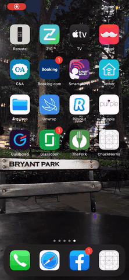

# Chuck Norris

A simple iOS app that lets you read some Chuck Norries jokes randomly based on categories



## Architecture

The app is built on **Clean MVVM-C** architecture with the Application, Domain and Services layers separated into they're own Xcode project/target in order to phisically create a separation of concerns boundary and leverage Swift's internal access level.

This achitectural design was inspired by Uncle Bob's [Clean Swift Architecture](https://clean-swift.com/) and ajusted to make the application layer "architecture agnostic" so it could be implemented in MVVM, MVP, MVC etc.


### Prerequisites

```
Xcode 11.1
iOS 9.*
```

### Installing

Run:
```
pod install
```

And open:
```
ChuckNorris.xcworkspace
```

## Running the tests

In order to run snapshot tests properly the use of the `iPhone 8` simulator is **required**.

## Built With

* [RxSwift](https://github.com/ReactiveX/RxSwift) - FRP framework
* [Quick/Nimble](https://github.com/Quick/Nimble) - Unit test framework
* [KIF](https://github.com/kif-framework/KIF) - Functional testing framework
* [iOSSnapshotTestCase](https://github.com/uber/ios-snapshot-test-case) - Snapshot view unit tests framework

## Authors

* **Tiago Leme** - [github](https://github.com/tfleme) - [linkedin](https://www.linkedin.com/in/tiagoleme/)
